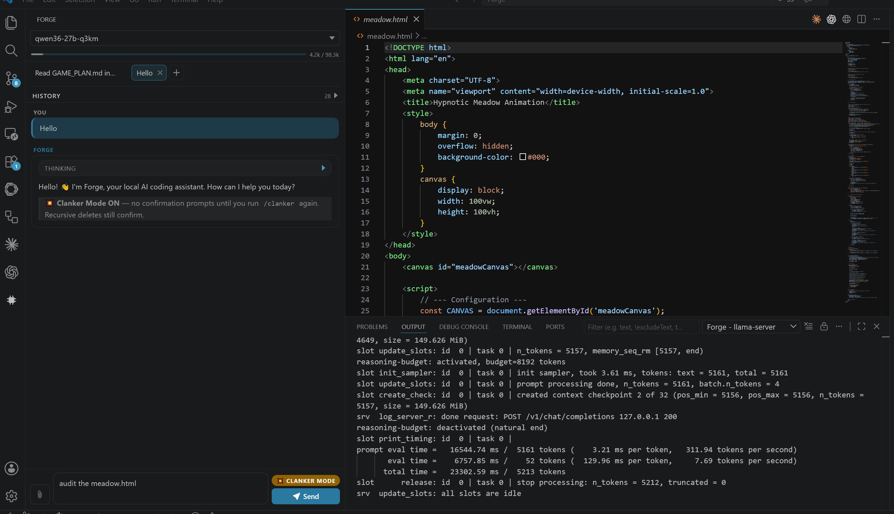
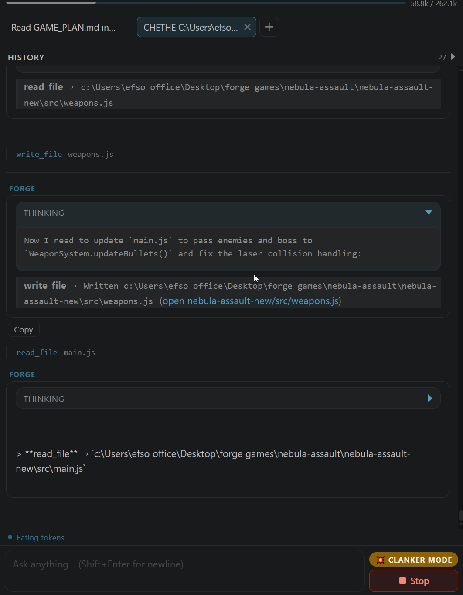
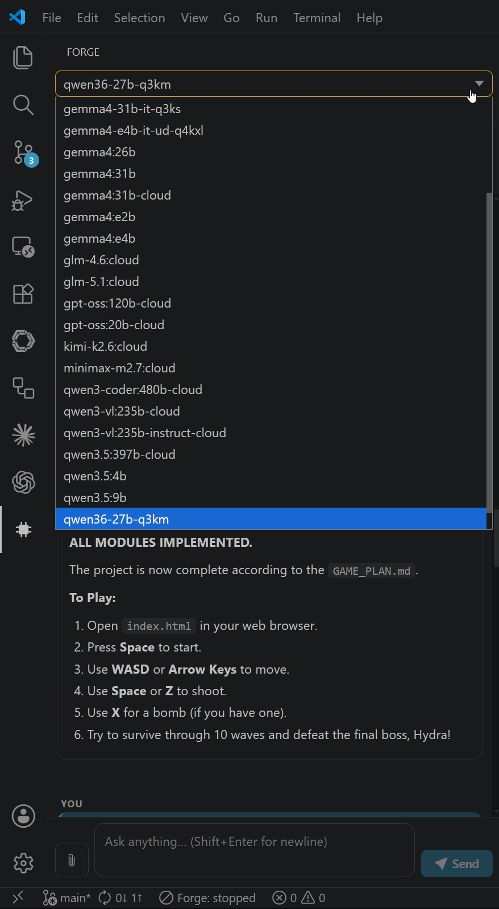
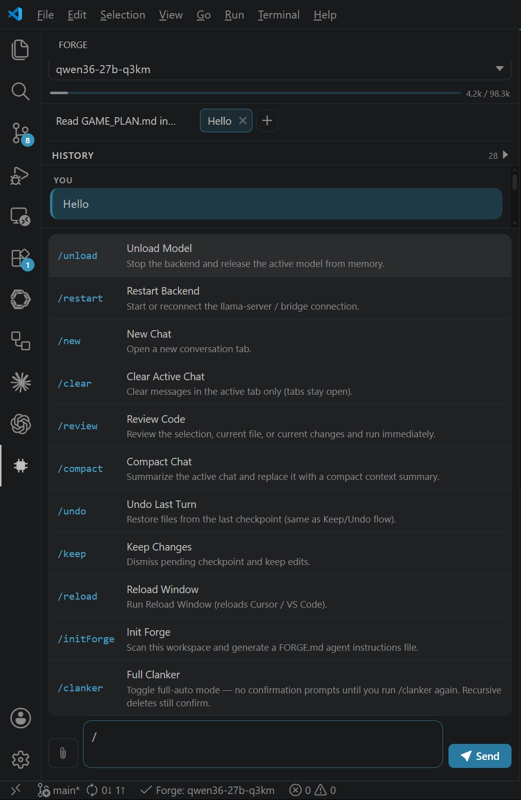
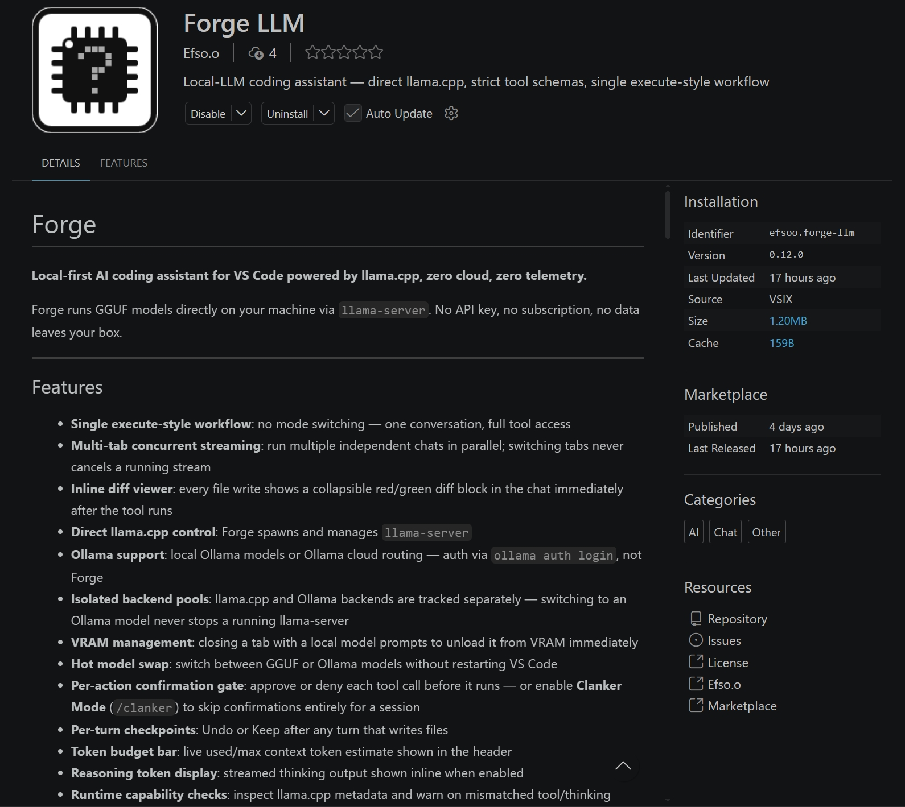

# Forge LLM - Official Repository

> This is the official Forge LLM extension by [Efsoo](https://github.com/Efs-O).
> Licensed under Apache License 2.0. If you fork this project, keep the copyright notices, `LICENSE`, and `NOTICE`, and document significant changes.

# Forge

Forge is a local-first AI coding assistant for VS Code.

Its default and strongest path is still local: GGUF models through `llama-server`, local Ollama models, strict tool schemas, per-action confirmation, and per-turn undo. Forge now also supports optional cloud or OpenAI-compatible providers for users who explicitly configure them. Telemetry remains none.



## Screenshots

|          Agent loop + Clanker Mode          |                  Model picker                   |
| :-----------------------------------------: | :---------------------------------------------: |
|  |  |

|                   Slash commands                    |                  Marketplace                  |
| :-------------------------------------------------: | :-------------------------------------------: |
|  |  |

## Current Positioning

- Local-first by default.
- `llama.cpp` and local Ollama remain first-class.
- Optional cloud and OpenAI-compatible backends exist for users who opt in.
- No telemetry, analytics, or auto-update pings.
- Search and fetch stay explicit and user-configured.

## Highlights

- Single execute-style workflow with no mode switching
- Multi-tab chat with independent streaming per tab
- Per-action confirmation gate, plus `/clanker` full-auto mode
- Per-turn checkpoints with Keep and Undo
- Inline chat diffs after write tools
- Direct `llama-server` lifecycle management
- Ollama local and Ollama cloud routing through the local daemon
- Optional cloud or self-hosted providers: `xai`, `openrouter`, `openai`, `openai-compatible`
- Localhost control server for external orchestrators and worker fleets
- Reasoning token display and optional thinking-channel stripping
- Optional Tavily or Brave web search with keys stored in VS Code SecretStorage
- Local semantic code search and reindex support
- External MCP tool servers: bridge tools from any MCP stdio server into the agent's tool catalog with explicit capability classification

## What's New Since v0.12.3

- Added OpenAI-compatible cloud-provider support, including `xai`, `openrouter`, `openai`, and generic `openai-compatible`
- Added automatic xAI token resolution and refresh support
- Added localhost control-server support for load-on-demand model orchestration
- Added control-server commands in VS Code for ensure, release, and status
- Expanded Ollama support, including local daemon usage and cloud routing through the local Ollama daemon
- Added multi-worker and concurrency-oriented config examples
- Hardened backend lifecycle, readiness, and release behavior
- Added semantic code search reindexing flow and slash command support
- Improved diff display, checkpoint handling, and multi-tab chat behavior
- Added an MCP client bridge (`mcp_servers` in `config.yaml`): tools from external MCP stdio servers are auto-discovered with read-only access by default and can be explicitly classified for sensitive capabilities
- Verified Cerebras Cloud as an `openai-compatible` provider (per-model `endpoint: https://api.cerebras.ai`) and split sampling defaults so cloud providers no longer receive local-only params (`top_k`, `min_p`)

## Requirements

- VS Code 1.90 or later
- One of:
  - `llama-server` plus one or more GGUF files
  - a running Ollama daemon
  - an already-running OpenAI-compatible server
  - an explicitly configured cloud provider model

## Backend Modes

### 1. Direct GGUF mode

Forge starts and manages `llama-server` itself.

Best for:

- local GGUF workflows
- direct control over server args
- keeping everything on your own machine

### 2. Ollama mode

Forge talks to the local Ollama daemon at `http://127.0.0.1:11434`.

Best for:

- local Ollama models
- Ollama cloud routes after `ollama auth login`
- users who want model management outside Forge

### 3. Optional cloud / OpenAI-compatible providers

Forge can also call explicitly configured cloud providers, or any
already-running OpenAI-compatible server (pre-managed local servers, custom
wrappers, external infra) via the `openai-compatible` provider with an
`endpoint`.

Supported provider values:

- `xai`
- `openrouter`
- `openai`
- `openai-compatible`

`openai-compatible` covers any endpoint that speaks the OpenAI chat API — for
example Cerebras Cloud (`endpoint: https://api.cerebras.ai`, key stored in
SecretStorage under the name you set as `api_key_secret`).

This is opt-in. Nothing uses a cloud provider unless you configure a model that points to one and provide its token through VS Code SecretStorage.

## Quick Start

### 1. Install the extension

Install Forge from the VS Code Marketplace or load the packaged VSIX.

### 2. Create `.forge/config.yaml`

Forge looks for:

`<workspace>/.forge/config.yaml`

The setup wizard can generate it for you, or you can start from [`config/config.example.yaml`](config/config.example.yaml).

Minimal direct GGUF example:

```yaml
active_model: my-model

llama_server:
  binary: /path/to/llama-server
  host: 127.0.0.1
  port: 8080
  n_gpu_layers: -1
  default_num_ctx: 32768
  n_batch: 512
  n_parallel: 4
  type_k: q8_0
  type_v: q8_0
  flash_attn_default: true

models:
  my-model:
    gguf_path: /path/to/model.gguf
    num_ctx: 8192
    flash_attn: true
    think: false
    strip_thinking_channels: true
    sampling:
      temperature: 0.6
      top_p: 0.95
      top_k: 64
      max_tokens: 8192
```

Ollama example:

```yaml
models:
  gemma4:26b:
    provider: ollama
    endpoint: http://127.0.0.1:11434
    num_ctx: 262144
    think: true
    reasoning_effort: medium
```

Already-running OpenAI-compatible server example:

```yaml
models:
  my-local-server:
    provider: openai-compatible
    endpoint: http://127.0.0.1:8080/v1
    api_key_secret: my-local-server-token # only if the server requires one
```

For larger examples, including control-server and cloud-provider patterns, use
[`config/config.example.yaml`](config/config.example.yaml).

### 3. Open the sidebar

Click the Forge icon in the activity bar and send a prompt.

If the config is missing or invalid, Forge will guide you through setup instead of silently failing.

## Cloud and Token Setup

Cloud or hosted OpenAI-compatible providers are explicit and credentialed through SecretStorage, not YAML.

- Use `Forge: Set Cloud Provider Token` to store a bearer token.
- Set `api_key_secret` on the model entry in `config.yaml`.
- For `openai-compatible`, also set `endpoint`.

Example:

```yaml
models:
  grok-code-fast:
    provider: xai
    api_key_secret: xai

  hosted-coder:
    provider: openai-compatible
    endpoint: https://example-host/v1
    api_key_secret: hosted-coder-token
```

## Control Server

Forge can expose a localhost model-control API so an external orchestrator can ask it to load a model and report the active endpoint.

Example:

```yaml
control_server:
  enabled: true
  port: 8799
```

Routes:

- `GET /healthz`
- `GET /models`
- `POST /ensure` with `{ "model": "..." }`
- `POST /release` with `{ "model": "..." }`

This is especially useful for multi-worker local fleets where an external process needs Forge to warm or release a model on demand.

## Search and Semantic Code Search

Forge supports:

- Tavily search
- Brave Search
- local semantic code search with a separate embedding model

Search API keys are stored in VS Code SecretStorage.

Use:

- `Forge: Set Search API Key`
- `/reindex` to rebuild the semantic index

## MCP Tool Servers

Forge can consume tools from external [MCP](https://modelcontextprotocol.io) stdio servers. Configure them in `config.yaml`:

```yaml
mcp_servers:
  - name: my-mcp-server
    command: C:/path/to/my-mcp-server.exe
    # args: [--flag]              # optional
    # max_result_chars: 24000     # optional; default 24000
    # tool_permissions:           # optional; unlisted tools are read-only
    #   dispatch_subagent: delegate
```

On activation Forge spawns each server, auto-discovers its tools via the MCP handshake, and registers unclassified tools under the read-only permission tier — no per-server code needed. Classify a sensitive tool with `tool_permissions`; for example, `delegate` requires `permissions.agents.delegate: true` before the tool is advertised or dispatched. Connection happens in the background: a slow or missing server binary never delays startup; its tools simply appear on the next chat turn once connected. A server that fails to connect logs an error and shows a warning toast, and duplicate tool names are skipped. Spawned server processes are stdio children of Forge (no network) and are terminated on extension deactivation.

Tool results are capped at `max_result_chars` (default 24000) before entering the conversation — oversized payloads are truncated with a visible marker so a verbose MCP server cannot overflow a local model's per-slot context window (`num_ctx / n_parallel` in direct llama.cpp mode).

## Local Delegation

Set `permissions.agents.delegate: true` to let the primary agent use `ask_local_agent` for a bounded, read-only consultation with another configured local model. The delegated model receives only the task and selected workspace files, has no tools, and cannot edit files or run commands; its response is advisory analysis returned to the primary conversation.

Forge also supports bounded coding workers through `dispatch_workers` and the
`Forge: Dispatch Workers` command. Each worker receives an independent task,
workspace-wide bounded read access, plus optional write access only to the exact
files assigned to it. Read-only runs require `permissions.agents.delegate` and
`permissions.fs.read`; `permissions.fs.write` is required only when at least one
worker has `access: write`. Workers can read/list files and use bounded file/code
search, document symbols, and file-scoped diagnostics. Cloud-routed workers additionally require the explicit
`permissions.agents.cloud_workers: true` opt-in and always show a non-bypassable
approval before any task or workspace content is sent to the configured provider.

The coordinator can call `list_worker_models` to discover exact configured model
names instead of asking you to construct worker arguments. Ollama targets are
best-effort because the daemon manages loading. Opt-in OpenAI-compatible models
and Ollama cloud routes are catalogued only when cloud workers are enabled. A
profile such as `model@reviewer` shares the same underlying backend as `model`.

To consult a different direct llama.cpp model without evicting the primary model, configure enough slots, for example `max_simultaneous_models: 2`. Slot availability prevents Forge from evicting the primary backend, but it does not guarantee the machine has enough RAM or VRAM to load the second model. Delegation is limited to 120 seconds and returned analysis is capped at 24,000 characters.

## Slash Commands

Type `/` in chat to open the built-in command list.

| Slash command | What it does                                |
| ------------- | ------------------------------------------- |
| `/unload`     | Stop all backends and release loaded models |
| `/restart`    | Restart or reconnect the backend            |
| `/reindex`    | Rebuild the local semantic search index     |
| `/new`        | Open a new conversation tab                 |
| `/clear`      | Clear the active tab only                   |
| `/review`     | Run an immediate review prompt              |
| `/compact`    | Summarize and compress the current chat     |
| `/undo`       | Restore files from the last checkpoint      |
| `/keep`       | Keep current checkpoint changes             |
| `/reload`     | Reload the VS Code window                   |
| `/initForge`  | Generate a workspace `FORGE.md`             |
| `/clanker`    | Toggle full-auto mode for confirmations     |

## VS Code Commands

These commands are currently contributed by the extension.

### Core sidebar and backend

| Command                       | Description                          |
| ----------------------------- | ------------------------------------ |
| `Forge: Open Sidebar`         | Open the Forge sidebar               |
| `Forge: Start Backend`        | Start the active backend             |
| `Forge: Stop Backend`         | Stop the active backend              |
| `Forge: Show Backend Console` | Reveal backend logs or console       |
| `Forge: Restart Backend`      | Restart the managed backend          |
| `Forge: Open Config`          | Open the active config file          |
| `Forge: Validate Config`      | Validate the active config           |
| `Forge: Pick Model`           | Pick the active model                |
| `Forge: Pick GGUF Model File` | Pick a GGUF file during setup        |
| `Forge: Setup Wizard`         | Run the first-run or repair flow     |
| `Forge: Unload Model`         | Stop all backends and release models |
| `Forge: New Chat`             | Open a new conversation tab          |
| `Forge: Clear Active Chat`    | Clear the active tab                 |
| `Forge: Undo Last Turn`       | Restore the previous checkpoint      |
| `Forge: Keep Changes`         | Accept the current checkpoint        |

### Control-server commands

| Command                                | Description                                  |
| -------------------------------------- | -------------------------------------------- |
| `Forge: Ensure Model (load on demand)` | Ask the control server to load a model       |
| `Forge: Release Model`                 | Ask the control server to release a model    |
| `Forge: Control Server Status`         | Show control-server status and active models |

### Tokens, search, and setup helpers

| Command                           | Description                         |
| --------------------------------- | ----------------------------------- |
| `Forge: Set Search API Key`       | Store a Tavily or Brave API key     |
| `Forge: Set Cloud Provider Token` | Store a cloud-provider bearer token |

### Editor and review helpers

| Command                                   | Description                                  |
| ----------------------------------------- | -------------------------------------------- |
| `Forge: Explain Selection`                | Explain the active selection                 |
| `Forge: Review Selection`                 | Review the active selection                  |
| `Forge: Generate Tests For Selection`     | Draft tests for the selection                |
| `Forge: Refactor Selection`               | Refactor the selection                       |
| `Forge: Run Explain Selection`            | Execute the explain flow immediately         |
| `Forge: Run Review Selection`             | Execute the review flow immediately          |
| `Forge: Run Generate Tests For Selection` | Execute the test-generation flow immediately |
| `Forge: Run Refactor Selection`           | Execute the refactor flow immediately        |
| `Forge: Explain Diagnostic`               | Explain an editor diagnostic                 |
| `Forge: Propose Fix For Diagnostic`       | Draft a fix for a diagnostic                 |
| `Forge: Run Fix For Diagnostic`           | Execute a fix flow for a diagnostic          |
| `Forge: Propose Fix For File Diagnostics` | Review diagnostics across the active file    |
| `Forge: Use Current File As Context`      | Prefill context with the current file        |
| `Forge: Use Selection As Context`         | Prefill context with the selection           |
| `Forge: Use Open Tabs As Context`         | Prefill context from open tabs               |
| `Forge: Pick Files For Context`           | Pick context files manually                  |
| `Forge: Draft Plan In Scratch Document`   | Generate a planning scratch doc              |
| `Forge: Draft Review In Scratch Document` | Generate a review scratch doc                |

## Checkpoints, Diffs, and Clanker Mode

- Every write turn can produce a checkpoint that you can Keep or Undo.
- Undo restores each requested mutation path to its state at the start of the turn. For tools that create missing parent directories, those empty implementation-created parents may remain after undo; requested files and directories are restored or removed exactly.
- File writes produce inline diff cards in the chat.
- Confirmation gates protect writes, terminal actions, and git actions.
- `/clanker` disables those prompts for the session, except recursive deletes which still require approval.

## Privacy

Forge does not send telemetry, analytics, or auto-update pings.

Outbound traffic is limited to the endpoints you explicitly use:

- local `llama-server`
- local Ollama daemon
- an explicitly configured cloud or OpenAI-compatible provider endpoint
- Tavily or Brave if search is enabled
- user-approved fetch targets

Configured MCP servers run as local stdio child processes — Forge sends them no network traffic.

## Development

Quality gates:

```bash
npx tsc --noEmit
npx vitest run
npm run package
```

## License

Apache 2.0. See [LICENSE](LICENSE).
