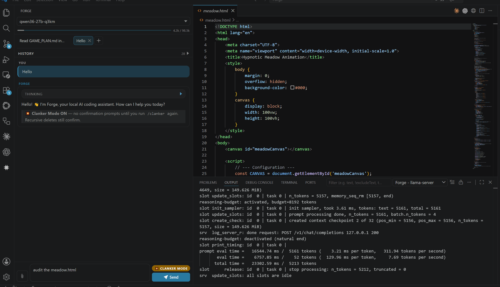
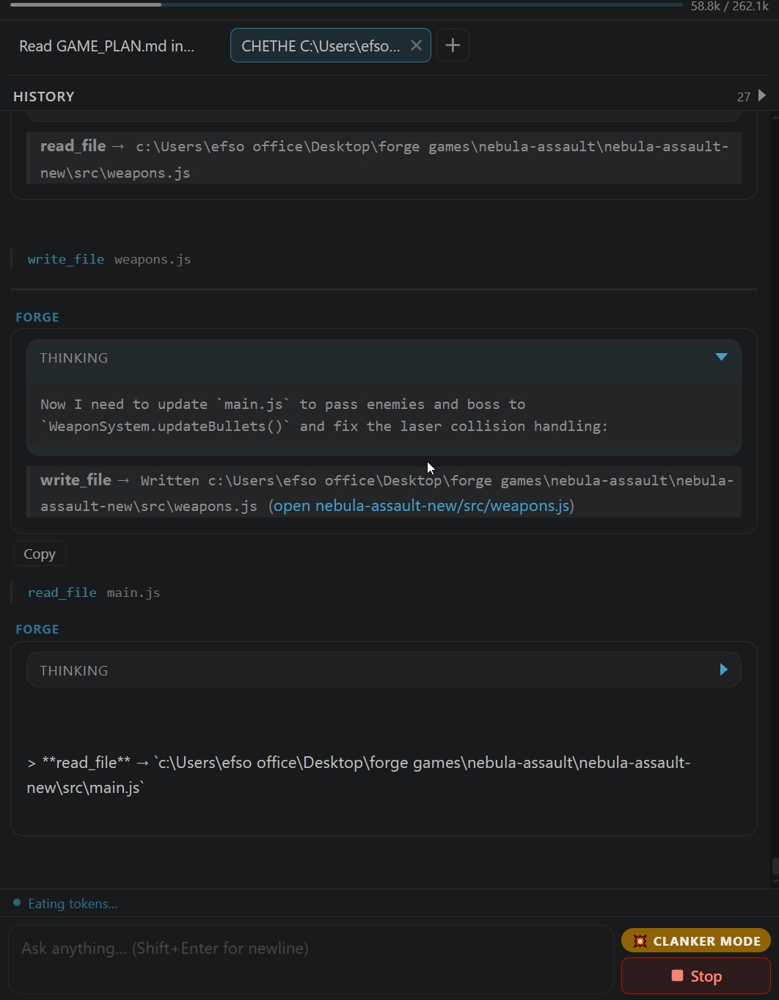
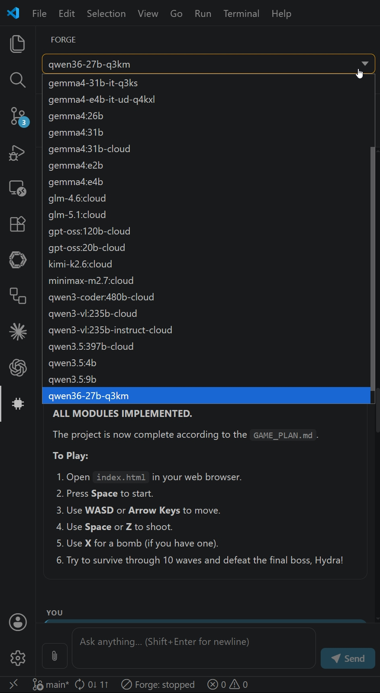
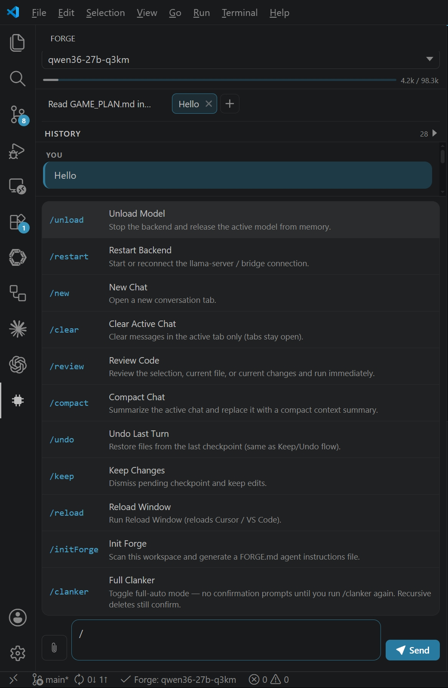
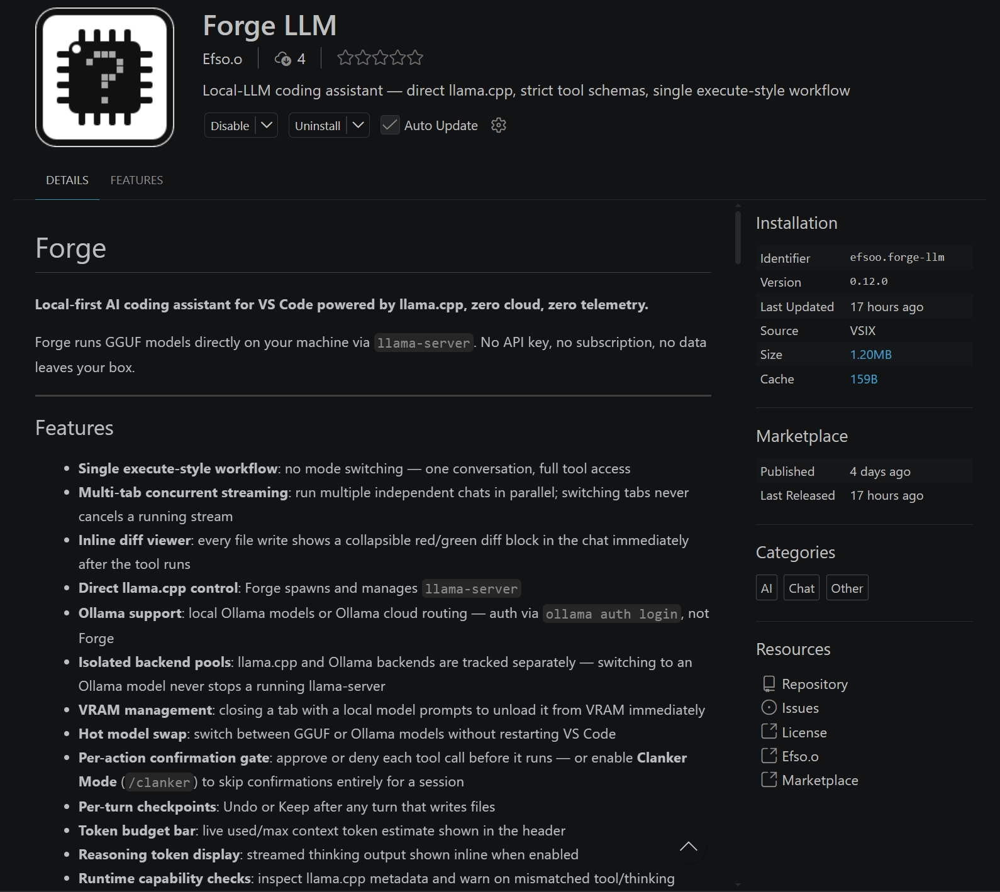

# Forge LLM

[](https://marketplace.visualstudio.com/items?itemName=Efsoo.forge-llm)
[](https://open-vsx.org/extension/Efsoo/forge-llm)
[](https://marketplace.visualstudio.com/items?itemName=Efsoo.forge-llm)
[](LICENSE)

> **The VS Code coding agent built for people who run their own models.**

Load GGUF models through llama.cpp, share one loaded model across VS Code
windows, use tool calling hardened for local-model context limits, and review
file-changing turns with visible diffs and Keep/Undo checkpoints. Forge has no
telemetry and requires no cloud account.

This is the official Forge LLM extension by [Efsoo](https://github.com/Efs-O),
licensed under Apache License 2.0. Cloud and OpenAI-compatible providers are
available only when you explicitly configure them.

## Why Forge

- **First-class llama.cpp control.** Forge starts, monitors, shares, restarts,
  and unloads `llama-server`; it does not treat your local runtime as merely
  another API URL.
- **Tools engineered for local models.** Strict schemas, per-slot context
  budgeting, truncated-call recovery, bounded results, and chunked writes keep
  smaller local models productive through long coding turns. A cut-off tool call
  is never dispatched as if it had run: it is retried smaller, with thinking
  temporarily suppressed so the retry has more room than the attempt that
  failed. What each of these actually does is in
  [docs/LOCAL_MODEL_OPTIMIZATIONS.md](docs/LOCAL_MODEL_OPTIMIZATIONS.md).
- **Reversible agent work.** Confirmation gates, inline diffs, and per-turn
  Keep/Undo checkpoints make file-changing actions visible and recoverable.
- **Bring the runtime you prefer.** Use direct GGUF loading, local or
  daemon-routed Ollama, an explicitly configured OpenAI-compatible provider, or
  an already-authenticated Claude Code or Codex CLI.
- **Local and frontier agents working together.** The agent mesh connects
  Forge to Claude Code, Codex and Copilot sessions on the same machine, each
  signed in with its own CLI login. Your local model can ask the Codex or Claude
  session you already have open (with its project context) and get the answer
  back, and those sessions can message, check on, or steer Forge in return. See
  [the agent mesh](#the-agent-mesh).
- **Depth, not a chat box.** Background execution, LSP-backed code
  intelligence, terminal awareness in both directions, git, vision, and durable
  memory — see [what the agent can do](#what-the-agent-can-do).
- **It follows you out of the room.** Optional Telegram control with
  authenticator-based session locking lets you run a turn, answer its approval
  gate, and read the diff from your phone.

Local execution is the default. Search, fetch, cloud providers, and external
CLI agents run only when you configure or invoke them, and Forge sends no
telemetry, analytics, or auto-update pings.



## Screenshots

|          Agent loop + Clanker Mode          |                  Model picker                   |
| :-----------------------------------------: | :---------------------------------------------: |
|  |  |

|                   Slash commands                    |                  Marketplace                  |
| :-------------------------------------------------: | :-------------------------------------------: |
|  |  |

## Highlights

- Single execute-style workflow with no mode switching
- Multiple conversations with independent streaming, all available from history
- Per-action confirmation gate, plus `/clanker` full-auto mode
- Per-turn checkpoints with Keep and Undo
- Inline chat diffs after write tools
- Background execution: start a long command, keep working, monitor it as it runs
- A task plan the agent keeps, re-injected verbatim so a context compaction cannot lose it
- Demand-loaded tool groups, so a large tool surface costs starting context only when used
- Terminal awareness: the agent sees the commands you run and how its own turned out
- Frame extraction from workspace video for vision models (`view_video`, needs ffmpeg)
- Direct `llama-server` lifecycle management
- Ollama local and Ollama cloud routing through the local daemon
- Optional cloud or self-hosted providers: `xai`, `openrouter`, `openai`, `openai-compatible`
- External CLI agents (`provider: cli` — Claude Code, Codex) as full-rights agents — both in direct chat and as `ask_local_agent` delegation targets, where they can read and edit the workspace with their own tools — using each CLI's own authentication. See [delegation](docs/DELEGATION.md) for which runs Keep/Undo covers
- Agent mesh: two-way messaging between Forge and live Claude Code, Codex and Copilot sessions (`ask_live_session`, `tell_live_session`, `forge.sh say`/`steer`/`who`)
- Localhost control server for external orchestrators and shared model lifecycle
- Reasoning token display and optional thinking-channel stripping
- Optional Tavily or Brave web search with keys stored in VS Code SecretStorage
- Local semantic code search and reindex support
- External MCP tool servers: bridge tools from any MCP stdio server into the agent's tool catalog with explicit capability classification
- Optional private-owner remote control through Telegram: local pairing,
  Google Authenticator-compatible session locking, approval gates and live
  progress on your phone — see [run it from your phone](#run-it-from-your-phone)
- LSP-backed code intelligence: definitions, references, implementations,
  diagnostics, code actions, and symbol rename through VS Code's own language servers
- Durable agent memory across sessions (`remember` / `recall`)

## What's New

Forge ships a **Changelog** tab next to this one — that is the full account,
every release. The short version of the latest releases: 0.16.35 moved
archived chats out of VS Code workspace storage so saving a tool round no
longer reserializes the whole archive; 0.16.33 and 0.16.32 made compaction
work for thinking and cloud models and made failures stop cleanly; 0.16 added
`generate_image` for configured image APIs, `restore_file`, commit amend and
multi-question `ask_user`, made semantic indexing survive any workspace, and
tidied Telegram — photo albums as one prompt, one `/model` command, commands
that clean up after themselves; 0.15 cut the system prompt, made VRAM-loading
delegation ask first, and grew the phone into a real second seat — voice in and
out, a readable transcript, a machine report, and sleep/wake; 0.14 made tool
schemas demand-loaded and the prompt prefix stable.

## What the agent can do

More than sixty native tools, all strict-schema, all permission-gated, and all
advertised per round rather than per turn — so a capability you enable becomes
usable immediately. Groups an agent rarely needs are demand-loaded through
`load_tool_group` and cost no context until called.

The first load in a conversation pauses while the model re-reads its context:
about **100 seconds at 70K tokens** and **190 seconds at 120K tokens** on the
reference machine (Qwen3.8-27B, llama.cpp b11243). Only rare tool groups use this
path; frequently used code and git tools stay available by default.

**Files and edits.** `read_file`, `write_file`, `append_file`, `edit_file` with
batched `edits[]`, `apply_line_edits`, `insert_code`, `create_directory`,
`move_file`, `list_directory`. `delete_file` moves to the recycle bin rather
than destroying. Every write is checkpointed and shown as a diff.

**Code intelligence, through VS Code's own language servers** — not grep
heuristics. `code_intel` handles diagnostics, document/workspace symbols, hover,
definitions, references, implementations and code actions. `apply_code_action`,
`rename_symbol` and `format_file` remain separate write tools. The agent sees the same analysis your editor does, so it answers
"who implements this?" instead of guessing from a name.
Its operation values are `diagnostics`, `document_symbols`, `workspace_symbols`,
`hover`, `definition`, `references`, `implementations` and `code_actions`.

**Search.** `search_code` and `find_files` (both ripgrep — one index, so they
cannot disagree), plus `search_codebase` for local semantic search over your
own embeddings.

**Background execution.** `exec_command` starts a long-running command and
returns immediately; `monitor_execution` reads its output as it accumulates,
`list_executions` recovers an id the agent lost, `stop_execution` ends it. Also
`wait`, for the gap nothing else covers: giving a dev server you just launched
or a file you just wrote a moment to become observable, instead of retrying a
check that cannot succeed yet.

**Terminal awareness, in both directions.** `run_terminal` pastes into your
real terminal and reports how it turned out via shell integration. The agent
also _sees the commands you run yourself_ — including the ones that failed — so
it corrects them in chat instead of asking you to paste output it already has.
`query_powershell` and `run_workspace_task` /
`list_workspace_tasks` cover the structured cases; `exec_command` runs `npm
test` / `npm run <script>` directly (no shell needed).

**Git.** `git_read` handles status, diff, log, blame and show (including a file
at any past commit). `restore_file` (brings a path back from a commit,
checkpointed), `stage`, `commit` (including `amend`), `create_branch` and
`switch_branch` remain separate tools. Git reads run the CLI directly; the VS
Code Git extension is not required.
Its operation values are `status`, `log`, `diff`, `blame` and `show`.

**Delegation.** `ask_local_agent` hands a task to another configured model or
CLI agent; `list_delegation_targets` lists them on demand instead of spending
schema on every turn. Local and cloud targets get the task and context files
only. Claude Code and Codex run with their own tools and can edit files.
`ask_live_session` and `tell_live_session` reach a Claude Code, Codex or
Copilot session that is *already running* and knows the current work — see
[the agent mesh](#the-agent-mesh).

**Images.** `generate_image` appears only when an `image_generation:` backend
is configured; every call asks for approval because each image is billed.

**Editor context.** `get_editor_context` lets the agent read the file and
selection you are actually looking at; `replace_selection` and `show_diff`
write back into it.

**Vision.** `view_image` for screenshots and diagrams, `view_video` for frames
sampled out of a workspace clip (needs ffmpeg).

**Browser and desktop.** Computer-use tools require a vision model and the
corresponding `permissions.browser.enabled` or `permissions.desktop.enabled`
setting. Desktop tools click and type into whichever window is focused.

**Memory that outlives the conversation.** `remember`, `recall`, and
`list_memories` give the agent durable notes across sessions, separate from
transcript history.

**A task plan that survives compaction.** `update_plan` records the work as
conversation state, re-injected verbatim every round and never summarized — so
a context compaction costs at most one stale item instead of the whole thread.

**Reaching you.** `notify_user` and `show_notification` reach whichever surface
started the turn — the sidebar, or your phone. `ask_user` asks a real question,
or several related ones in a single round.

**Web, when you configure it.** `web_search` (Tavily or Brave, your key) and
`web_fetch`.

## Run it from your phone

Optional, off by default, and it opens no inbound port: Forge makes an
**outbound** connection to Telegram, and VS Code has to stay running. Full
setup and threat model in
[remote control](docs/REMOTE_CONTROL.md).

Once paired you have a real Forge session in a private chat — send a prompt,
watch live agent and compaction progress, resolve approval gates from the
phone or the desktop (first resolution wins), and send attachments.

**Locked behind two gates.** One exactly-matched provider user ID is paired,
private chats only, group and channel messages fail closed. Pairing is an
eight-digit one-time code that expires in five minutes and stops accepting
guesses after five tries. On top of that, an enrolled
**Google Authenticator-compatible TOTP secret**: the QR is displayed locally and
never sent through Telegram, the session starts locked after every reload,
re-locks on an inactivity timeout you set with `/timeout`, and `/lock` ends it
on demand. Bot token and owner ID live in SecretStorage; the session and its
replay protection are memory-only.

**Built to survive the transport.** Prompts, deduplication records, and the
provider cursor are durable, and the update offset advances only after Forge
has genuinely accepted, handled, rejected or recognised an event as a
duplicate — a dropped connection re-delivers rather than loses, and a
re-delivery is recognised rather than run twice. Final responses go out through
an at-least-once outbox. One fenced lease stops two VS Code windows consuming
the same bot.

**Talk to it.** Send a voice note and it is transcribed and run as a prompt;
`/voice` turns spoken replies on, synthesized locally with Piper. Both
directions stay on your machine — the same rule as everything else here. A
voice note from an unpaired sender is rejected with a reason rather than
silence.

**Read it back.** `/view [n]` replays the last few exchanges into the chat.
Live progress is pushed as a single message edited in place, so a phone that
was asleep sees the final state and never the edits it missed — `/view` is the
pull that covers that gap. `/system` reports GPU, VRAM by process, RAM and
drives, which is how you find out from a train why the model will not load.

**Commands.** `/status`, `/context`, `/system`, `/view`, `/stop`,
`/steer <prompt>` (jumps the queue and interrupts the active turn), `/new`,
`/chats`, `/chat`, `/resume`, `/model`, `/queue`, `/drop`,
`/ratelimit`, `/unload`, `/unloadall`, `/restart`, `/reload`, `/compact`, `/lock`,
`/timeout`, `/notify`, `/mirror`, `/voice`, `/clanker on|off`, `/workspace`,
`/sleep`, `/wake`, `/help`. Telegram shows them in its native command menu.

**`/sleep` and `/wake` need hardware Forge does not ship.** `/sleep` suspends
the machine; waking one that is suspended cannot be done by software running on
it, so `/wake` is answered by a separate always-on device on the same LAN that
sends the magic packet. Forge's half is a private-LAN receiver, off unless you
configure `remote.wake_relay`, and it authenticates every request with an
HMAC-SHA-256 signature over a timestamp and nonce whose secret lives in
SecretStorage.

The audit log is metadata only — timestamps, channel, action, request id, and
truncated identity hashes. No prompt text, no responses, no secrets, no paths.

WhatsApp exists as a separately opt-in experimental linked-device adapter.

## Requirements

- VS Code 1.90 or later
- One of:
  - `llama-server` plus one or more GGUF files
  - a running Ollama daemon
  - an already-running OpenAI-compatible server
  - an explicitly configured cloud provider model
  - an authenticated Claude Code or Codex CLI for `provider: cli`
  - an authenticated Claude Code, Codex or Copilot CLI for the agent mesh

### Optional: ffmpeg, for `view_video`

The `view_video` tool samples still frames from a workspace video clip and sends
them to a vision model. It needs **ffmpeg and ffprobe** on `PATH` (Windows:
`winget install Gyan.FFmpeg`; macOS: `brew install ffmpeg`), or an explicit
`video.ffmpeg_path` in `config.yaml`. Nothing else in Forge uses ffmpeg, so
skip it if you do not need video.

Frames cost prompt tokens — an unscaled 1080p clip can exceed a 16k context on
its own. `video.frame_max_dimension` (default 640) is the knob; see the measured
table in `config/config.example.yaml`.

### Optional: Claude Code and Codex

Forge runs the `claude` and `codex` **CLIs** directly, not their VS Code
extensions, so:

1. **Install each CLI and log in with it**: run `claude` once and sign in, and run `codex login`. Forge
   never holds their keys; each uses its own login.
2. **Have them in `config.yaml`.** The setup wizard adds them when it finds
   them on `PATH`. To add them by hand:
   ```yaml
   models:
     - name: claude-code
       provider: cli
       cli: claude   # bare name, looked up on PATH; an absolute path also works
     - name: codex
       provider: cli
       cli: codex
   ```
   For `ask_local_agent` delegation, also set `permissions.agents.delegate: true`.
3. **If you run Claude Code in bypass-permissions mode**, add
   `"crossSessionInbound": "accept"` to `~/.claude/settings.json`. Otherwise a
   message Forge sends to your open Claude session waits for your approval there.
4. **Windows:** Codex needs PowerShell 7 installed from the **MSI** (the
   Microsoft Store package does not work), and the `~/.forge/agent-bus/forge.sh`
   client needs **Git Bash** — in PowerShell a bare `bash` is WSL.

5. **For the agent mesh** (`forge.sh`), turn on both the control server and the
   bus. Both are off by default:
   ```yaml
   control_server:
     enabled: true
   agent_bus:
     enabled: true
   ```

Nothing needs to go into Claude's memory or an `AGENTS.md`: Forge writes its own
agent-bus notes to `~/.forge/agent-bus/`, and every message it sends carries its
own reply instructions.

**Model and effort for a Forge-owned Codex/Claude session.** With no joined
session, Forge may create its own owned Codex or Claude CLI process (the
agent-bus mesh, above); by default it runs each CLI's own configured default
model and effort. Four optional `agent_bus:` keys pick them instead:

```yaml
agent_bus:
  codex_model: gpt-6-luna
  codex_effort: high # low | medium | high | xhigh | max
  claude_model: opus
  claude_effort: high
  copilot_model: auto # the default; see below
```

`copilot_model` is the exception: it defaults to `auto`, because with no
`--model` the Copilot CLI runs its premium default model on every call. Set it
to a model name to pin one.

Unset keys keep today's behaviour: Forge passes nothing and the CLI's own
config decides. A change applies at the next owned-session creation, not to a
session already running — restart `forge.sh`/the mesh (or reload the window)
to pick it up. Codex/Claude reject an unknown model or effort value the same
way they would from a terminal; Forge surfaces that error unchanged.

## Backend Modes

### 1. Direct GGUF mode

Forge starts and manages `llama-server` itself.

Best for:

- local GGUF workflows
- direct control over server args
- keeping everything on your own machine

### 2. Ollama mode

Forge talks to the local Ollama daemon at `http://127.0.0.1:11434`.

Best for:

- local Ollama models
- Ollama cloud routes after `ollama auth login`
- users who want model management outside Forge

### 3. Optional cloud / OpenAI-compatible providers

Forge can also call explicitly configured cloud providers, or any
already-running OpenAI-compatible server (pre-managed local servers, custom
wrappers, external infra) via the `openai-compatible` provider with an
`endpoint`.

Supported provider values:

- `xai`
- `openrouter`
- `openai`
- `openai-compatible`

`openai-compatible` covers any endpoint that speaks the OpenAI chat API — for
example Cerebras Cloud (`endpoint: https://api.cerebras.ai`, key stored in
SecretStorage under the name you set as `api_key_secret`).

This is opt-in. Nothing uses a cloud provider unless you configure a model that points to one and provide its token through VS Code SecretStorage.

## Sharing one llama-server across windows

Opt-in, off unless you enable it:

```yaml
shared_runtime:
  enabled: true
```

A second VS Code window asking for a model another window already loaded
**borrows that running llama-server** instead of spawning its own. One copy of
the weights in VRAM. The borrowing window takes a lease; the owner will not shut
down while a lease is outstanding, and a lease left behind by a crashed window
is reclaimed once its process is confirmed gone.

Conversations are not shared — each window keeps its own open chats, messages and
checkpoints. **KV cache slots are**, and that is the part that surprises people:
alternating windows evict each other's cached prefix and each pays full prompt
re-processing. Answers stay correct; you lose the cache speedup.
[How sharing behaves in detail](docs/SHARED_RUNTIME.md) covers the slot maths,
what the token counter is really measuring, and why `max_simultaneous_models`
is not the setting for this.

## Quick Start

### 1. Install the extension

Install Forge from the VS Code Marketplace or Open VSX, or load the packaged VSIX.

**Easiest: let Claude Code or Codex set it up.** Run **Forge: Set Up With
Claude Code / Codex** from the Command Palette. It copies a prompt that points
your agent at `AI_SETUP.md`, which ships with the extension. The agent surveys
your GPU and model files, installs llama.cpp if you need it, writes the config,
and checks the result against Forge itself. It stops and asks you whenever a
step needs you: a window reload, a login, or a key, which you enter into VS Code
yourself and never into a file or the chat. The steps below are the manual
route.

### 2. Create `.forge/config.yaml`

Forge looks for:

`<workspace>/.forge/config.yaml`

The setup wizard can generate it for you, or you can start from [`config/config.example.yaml`](config/config.example.yaml).

Minimal direct GGUF example:

```yaml
active_model: my-model

llama_server:
  binary: /path/to/llama-server
  host: 127.0.0.1
  port: 8080
  n_gpu_layers: -1
  default_num_ctx: 32768
  n_batch: 512
  n_parallel: 4
  type_k: q8_0
  type_v: q8_0
  flash_attn_default: true

models:
  my-model:
    gguf_path: /path/to/model.gguf
    num_ctx: 8192
    flash_attn: true
    think: false
    strip_thinking_channels: true
    sampling:
      temperature: 0.6
      top_p: 0.95
      top_k: 64
      max_tokens: 8192
```

Ollama example:

```yaml
models:
  gemma4:26b:
    provider: ollama
    endpoint: http://127.0.0.1:11434
    num_ctx: 262144
    think: true
    reasoning_effort: medium
```

Already-running OpenAI-compatible server example:

```yaml
models:
  my-local-server:
    provider: openai-compatible
    endpoint: http://127.0.0.1:8080/v1
    api_key_secret: my-local-server-token # only if the server requires one
```

For larger examples, including control-server and cloud-provider patterns, use
[`config/config.example.yaml`](config/config.example.yaml).

### 3. Open the sidebar

Click the Forge icon in the activity bar and send a prompt.

If the config is missing or invalid, Forge will guide you through setup instead of silently failing.

## Coding benchmark smoke test

Forge includes a one-task SWE-bench Verified smoke runner. Install the official
`swebench` package and Docker, copy `benchmarks/smoke-task.example.json` to
`benchmarks/smoke-task.json`, and pin one `instance_id` (and dataset revision).
Start the Qwen llama-server normally, then validate without model calls:

```powershell
npm run bench:smoke -- --dry-run
npm run bench:smoke
```

Use `--arms qwen-forge,qwen-minimal` for a local-only rehearsal. Each arm gets
an exact-base disposable checkout and writes logs, patch, evaluator output,
runtime facts, and usage under `results/<run-id>/<arm>/`. The report ranks this
single task only; one task is not a SWE-bench score, and published SWE figures
are not mixed into the local ranking.

Before spending evaluator or agent-session usage, ping both Qwen arms against
the served llama-server:

```powershell
npm run bench:ping
```

The ping command never launches Claude or Codex. It loads the Forge-configured
Qwen server for `qwen-forge`, unloads it, starts the same GGUF through Forge's
baseline direct lifecycle for `qwen-minimal`, and stores both replies and server
facts under `results/ping-<run-id>/`.

## Cloud and Token Setup

Cloud or hosted OpenAI-compatible providers are explicit and credentialed through SecretStorage, not YAML.

- Use `Forge: Set Cloud Provider Token` to store a bearer token.
- Set `api_key_secret` on the model entry in `config.yaml`.
- For `openai-compatible`, also set `endpoint`.

Example:

```yaml
models:
  grok-code-fast:
    provider: xai
    api_key_secret: xai

  hosted-coder:
    provider: openai-compatible
    endpoint: https://example-host/v1
    api_key_secret: hosted-coder-token
```

## Control Server

Forge can expose a localhost model-control API so an external orchestrator can ask it to load a model and report the active endpoint.

Example:

```yaml
control_server:
  enabled: true
  port: 8799
```

Routes:

- `GET /healthz`
- `GET /models`
- `POST /ensure` with `{ "model": "..." }`
- `POST /release` with `{ "model": "..." }`

This is especially useful in multi-process local setups where an external process needs Forge to warm or release a model on demand.

## Search and Semantic Code Search

Forge supports:

- Tavily search
- Brave Search
- local semantic code search with a separate embedding model

Search API keys are stored in VS Code SecretStorage.

Use:

- `Forge: Set Search API Key`
- `/reindex` to rebuild the semantic index

## Image attachments

Image input requires a vision-capable model. For llama.cpp models, configure a
compatible `mmproj_path`; for other providers, declare the `vision` capability
only when that model accepts images. Forge stops before starting a request and
shows this setup guidance when an image is attached to a text-only model.

## MCP Tool Servers

Forge can consume tools from external [MCP](https://modelcontextprotocol.io) stdio servers. Configure them in `config.yaml`:

```yaml
mcp_servers:
  - name: my-mcp-server
    command: C:/path/to/my-mcp-server.exe
    # args: [--flag]              # optional
    # max_result_chars: 24000     # optional; default 24000
    # tool_permissions:           # optional; unlisted tools are read-only
    #   dispatch_subagent: delegate
```

On activation Forge spawns each server, auto-discovers its tools via the MCP handshake, and registers unclassified tools under the read-only permission tier — no per-server code needed. Classify a sensitive tool with `tool_permissions`; for example, `delegate` requires `permissions.agents.delegate: true` before the tool is advertised or dispatched. Connection happens in the background: a slow or missing server binary never delays startup; its tools simply appear on the next chat turn once connected. A server that fails to connect logs an error and shows a warning toast, and duplicate tool names are skipped. Spawned server processes are stdio children of Forge (no network) and are terminated on extension deactivation.

Tool results are capped at `max_result_chars` (default 24000) before entering the conversation — oversized payloads are truncated with a visible marker so a verbose MCP server cannot overflow a local model's per-slot context window (`num_ctx / n_parallel` in direct llama.cpp mode).

## Local Delegation

Set `permissions.agents.delegate: true` and the primary agent can use
`ask_local_agent` to hand a task to another configured model. A llama.cpp or
Ollama delegate receives only the task and the workspace files you allow, has no
tools, and its answer comes back as advisory analysis. A `provider: cli`
delegate (Claude Code, Codex) runs unrestricted with the CLI's own tools and can
edit the workspace itself; Forge checkpoints the workspace before it starts, so
Keep/Undo can roll the run back. Delegation is capped at
120 seconds and 24,000 characters, and a target that would load weights into
local VRAM asks you first.

A `provider: cli` model (Claude Code, Codex) is also a **full-rights direct
chat model**: Forge spawns the already-authenticated CLI locally and it runs
with its OWN tools — Forge does not inject its registry or run its tool loop for
it. Authentication is the CLI's own login, never a key held by Forge, and a
full-access CLI chat is still covered by Forge's checkpoint engine so Keep/Undo
can roll it back.

## The agent mesh

`ask_local_agent` starts a new, empty session. The mesh is for sessions that
already know what you are doing: the Claude Code or Codex you have open in a
terminal, or a Copilot session Forge started for you. Turn on
`control_server.enabled` and `agent_bus.enabled` (setup above).

- **Forge → them.** `ask_live_session` asks `claude`, `codex` or `copilot` a
  question and waits for the answer, or, with `notify_on_answer`, keeps
  working and receives the answer later as a message in the chat.
  `tell_live_session` is a one-way note that does not wait.
- **Them → Forge.** From any terminal, `~/.forge/agent-bus/forge.sh` lets a
  session `say` something to Forge, `steer` (interrupt) its running turn,
  check its `status`, `view` its last answers, and see `who` is in the mesh
  and what each member is doing.
- **No open window needed.** Run `forge.sh join codex` (or `join claude`) once
  in your session. After that, Forge can reach it even with no window open: it
  resumes that thread in the background, answers, and shuts it down again.
  Copilot always runs as a Forge-owned session.
- **Cost control.** `agent_bus.codex_model`/`codex_effort`,
  `claude_model`/`claude_effort` and `copilot_model` pick the model per CLI.
  Copilot defaults to `auto` so it does not use a premium model on every call.

A typical hybrid loop: Codex plans with file paths and checks → sends the plan
to Forge → your local model implements → it asks Codex to review the diff →
Codex steers the fixes. Every file change, including the CLI agents', is
covered by Keep/Undo.

[Delegation and CLI agents in detail](docs/DELEGATION.md) covers warm-process
lifecycle, cancellation, capacity limits, and the checkpoint settings.

## Slash Commands

Type `/` in chat to open the built-in command list. Forge also contributes commands to the VS Code palette — the full list is in [docs/COMMANDS.md](docs/COMMANDS.md).

| Slash command | What it does                                     |
| ------------- | ------------------------------------------------ |
| `/unload`     | Release only this chat's model from memory       |
| `/unloadall`  | Stop all backends and release every loaded model |
| `/restart`    | Restart or reconnect the backend                 |
| `/reindex`    | Rebuild the local semantic search index          |
| `/new`        | Open a new conversation                          |
| `/rename`     | Rename the active conversation                   |
| `/context`    | Add a file, selection, tabs, or files as context |
| `/config`     | Open the active Forge config                     |
| `/logs`       | Show the Forge backend output                    |
| `/clear`      | Clear the current conversation                   |
| `/review`     | Run an immediate review prompt                   |
| `/compact`    | Summarize and compress the current chat          |
| `/undo`       | Restore files from the last checkpoint           |
| `/keep`       | Keep current checkpoint changes                  |
| `/reload`     | Reload the VS Code window                        |
| `/initForge`  | Generate the active repository's `FORGE.md`      |
| `/clanker`    | Toggle full-auto mode for confirmations          |

## Checkpoints, Diffs, and Clanker Mode

- Every write turn can produce a checkpoint that you can Keep or Undo.
- External Claude/Codex turns become backend-ready only after their rollback checkpoint is safely prepared. Preparation and finalization progress appears in the chat activity stream.
- When `forge.checkpoint.externalCliEnabled` is explicitly disabled, external Claude/Codex turns start without scanning the workspace and without Forge Keep/Undo coverage; the chat activity stream displays a warning.
- External CLI checkpoints are isolated by conversation, stored outside the workspace, and removed on Keep, successful Undo, conversation close, or normal extension shutdown.
- If workspace contents change concurrently while Forge is preparing or finalizing a checkpoint, Forge stops and surfaces the conflict rather than claiming unsafe rollback coverage.
- Undo restores each requested mutation path to its state at the start of the turn. For tools that create missing parent directories, those empty implementation-created parents may remain after undo; requested files and directories are restored or removed exactly.
- File writes produce inline diff cards in the chat.
- Confirmation gates protect writes, terminal actions, and git actions.
- `/clanker` disables those prompts for the session, except recursive deletes which still require approval.

## Responsibility and Risk

**Forge runs an AI agent that edits and deletes files, runs commands, and makes
git changes on your machine. Use it at your own risk. The authors accept no
responsibility for lost work, deleted or corrupted files, destructive commands,
unwanted git operations, leaked information, or any other damage or loss
arising from its use.** This restates in plain language what the Apache 2.0
licence already says: the software is provided "AS IS", WITHOUT WARRANTIES OR
CONDITIONS OF ANY KIND, and no contributor is liable for any damages. See
sections 7 and 8 of [LICENSE](LICENSE).

Forge takes the safety measures it reasonably can, and you should understand
what each one does and does not cover:

- **Confirmation gates** on writes, terminal actions, and git actions. `/clanker`
  turns these off for the session — recursive deletes still ask.
- **Per-turn checkpoints** with Keep/Undo. Undo restores the paths a turn
  mutated; it is not a backup. Keep/Undo covers Forge's file tools only.
  Changes made by a command or script — `exec_command`, `run_terminal`, shell
  scripts, or a build — are not captured; git is the only way back. External
  CLI turns are only covered when checkpoint preparation succeeds.
- **`permissions.exec.shell_scripts`** lets the agent run PowerShell, `cmd` and
  `bash` scripts. The denylist still reads every script, but it is
  pattern-matching, not a sandbox: a script can do anything your user account
  can. **Off by default. Leave it off unless you commit before every agent run.**
- **A best-effort command denylist** for destructive git and shell operations.
  It is pattern-matching, not a sandbox; interpreters that were never banned,
  such as `node -e` and `python -c`, can already do what a shell script can.
- **Tool permissions in `config.yaml`.** A new install's starter config grants
  file edits and deletes, command execution and git writes, each behind the
  confirmation gate above. Web search, fetch, the browser and desktop tools,
  shell scripts and CLI-agent delegation stay off until you turn them on.
- **An SSRF-guarded, GET-only fetch** and no outbound traffic beyond the
  endpoints you configure.

None of this makes an agent safe to point at work you cannot afford to lose.
A model can misread an instruction, a path can resolve somewhere you did not
expect, and content fetched from the web or read out of a repository can carry
prompt injection that redirects the agent. `exec.headless`, `fs.delete` and
`git.write`, which the starter config turns on, hand real capability to a
process that will sometimes be wrong. **Use version control, commit before large agent runs, and
keep backups of anything that matters.**

## Privacy

Forge does not send telemetry, analytics, or auto-update pings.

Outbound traffic is limited to the endpoints you explicitly use:

- local `llama-server`
- local Ollama daemon
- an explicitly configured cloud or OpenAI-compatible provider endpoint
- Tavily or Brave if search is enabled
- user-approved fetch targets
- an authenticated Claude Code or Codex CLI agent you explicitly invoke; that CLI uses its own tools and network configuration

Configured MCP servers run as local stdio child processes — Forge sends them no network traffic.

## Development

Quality gates:

```bash
npm run ci
npm run package
```

## License

Apache 2.0. See [LICENSE](LICENSE).
